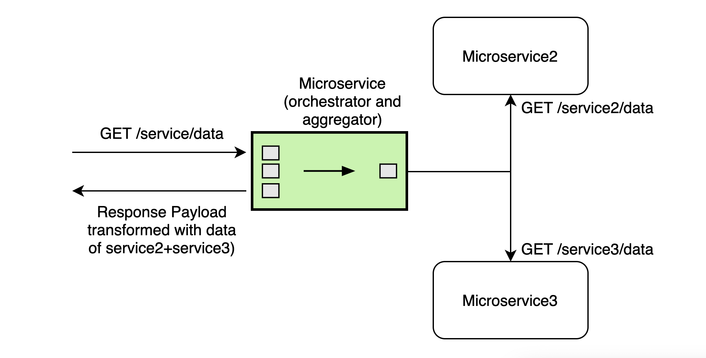

# cvs-svc-technical-records
Please install and configure [nvm](https://github.com/nvm-sh/nvm) with this node version so it can be used during installation.


## Architecture

To capture and persist technical records for a Vehicle submitted by the client (VTM) which is then made available to VTA/VTM for searching a vehicle. If the submitted technical record is applicable for a ministry plate certificate, it triggers the generation of the certificate via dynamo streams of the technical results table.

### End to end design
[All in one view](https://wiki.dvsacloud.uk/pages/viewpage.action?pageId=79254695)


### Technical record microservice
[Further details about this micro service](https://wiki.dvsacloud.uk/pages/viewpage.action?spaceKey=HVT&title=Technical+Records+Microservice).

#### API Specs
[Technical records API](https://wiki.dvsacloud.uk/download/attachments/33863060/API_Vehicle_Tech_Records_v32.yaml?version=2&modificationDate=1591883253725&api=v2).


#### Database Model
Being a NoSQL database data isn't stored in the relational model, but as a JSON document which is native to dynamodb database. The JSON document is the representation of API specification, hence API specification should be referred, to understand document structure stored in the database.

#### Database Indexes
       Table Name: cvs-{$environment-name}-technical-records

       Partition / Hash Key: systemNumber

       Sort Key: vin

       LSI: N/A

       GSI:
              primaryVrm (Partition Key),

              trailerId (Partition Key),

              vin (Partition Key),

              partialVin (Partition Key),

#### Interactions/Integration with other AWS service
The diagram illustrates that technical records integrate with Test Number service to request a unique number (systemNumber, trailorId, plateSerialNumber), before the information is saved into dynamo table. Technical record service also receives status updates from test result microservice to update a record from Provisional to Active [refer Test Result Submisson triggering Technical Record Status update](https://wiki.dvsacloud.uk/display/HVT/Test+Result+Submisson+triggering+Technical+Record+Status+update).


Above Diagram shows orchestration/event publishing involved within Technical Records service. Following are the approved patterns it uses:

#### Orchestration


#### Choregraphy


In order to understand more about the responsibility of technical records service in the end to end design, please refer to [Ministry Plate Generation Design](https://wiki.dvsacloud.uk/display/HVT/Ministry+Plate+Generation+Design). 

<br>

## Getting started

### Configuring the project

#### Run AWS Lambda node functions locally with a mock API Gateway and DynamoDB to test against

Before running the start script, please make sure you have changed your dynamoDB to point locally.

Please refer to [Local Running](#Local-Running) section and also make sure you have dynamoDB credentials set up.

Please request the relevant credentials to be added locally to the `~/.aws/credentials` file.

- `nvm use`
- `npm install`
- `node_modules/.bin/sls dynamodb install`
- `npm run build`
- `BRANCH=local npm start`


#### Hooks

Please make sure we have scanrepo installed on your machine before contributing to the project, [husky hooks](https://github.com/typicode/husky) are automatically configured.

##### Security

Please install and run the following securiy programs as part of your testing process:

- [git secrets](https://github.com/awslabs/git-secrets)

After installing, do a one-time set up with `git secrets --register-aws`. Run with `git secrets --scan`.

- [repo-security-scanner](https://github.com/UKHomeOffice/repo-security-scanner)

After installing, run with `git log -p | scanrepo`.

These will be run as part of prepush so please make sure you set up the git hook above so you don't accidentally introduce any new security vulnerabilities.

#### DynamoDB
If you want the database to be populated with mock data on start, in your `serverless.yml` file, you need to set `seed` to `true`. You can find this setting under `custom > dynamodb > start`.

If you choose to run the DynamoDB instance separately, you can send the seed command with the following command:

```sls dynamodb seed --seed=seed_name```

Under `custom > dynamodb > seed` you can define new seed operations with the following config:
```
custom:
    dynamodb:
        seed:
          seed_name:
            sources:
            - table: TABLE_TO_SEED
              sources: [./path/to/resource.json]
```

### SonarQube
In order to generate SonarQube reports on local, follow the steps:
- Download SonarQube server -> [sonarqube](https://binaries.sonarsource.com/Distribution/sonarqube/sonarqube-7.6.zip)
- Download SonarQube scanner -> [scanner](https://binaries.sonarsource.com/Distribution/sonar-scanner-cli/sonar-scanner-cli-3.3.0.1492-macosx.zip)
- Add sonar-scanner in environment variables -> In bash_profile add the line `"export PATH=<PATH_TO_SONAR_SCANNER>/sonar-scanner-3.3.0.1492-macosx/bin:$PATH"`
- Start the SonarQube server -> `cd <PATH_TO_SONARQUBE_SERVER>/bin/macosx-universal-64 ./sonar.sh start`
- In the microservice folder run the command -> `npm run sonar-scanner`

### Environmental variables

- The `BRANCH` environment variable indicates in which environment is this application running. Use `BRANCH=local` for local deployment. This variable is required when starting the application or running tests.

Feature flags are available within the application from `config.yml` file.
Below is the list of feature switches:
```
allowAdrUpdatesOnly // set to false by default, only validate ADR fields on PUT request
```
If you wish to toggle the switches, you will need to update its value, then run `npm run build` to rebuild the service and restart the server with `npm start`.


### Seeding the database

- From within the resource folder type the following:
```cat techRecords.json | json-dynamo-putrequest cvs-BRANCH-dft-tech-records --beautify >test.json```
```aws dynamodb batch-write-item --request-items file://test.json --region=eu-west-1```

### Local Running

To run this locally, add the following environment variables to your run configuration(s):
* AWS_XRAY_CONTEXT_MISSING = LOG_ERROR
* SLS_DEBUG = *
* BRANCH = LOCAL

and change the `serverless.yml` so that `Custom > DynamoDB >`
```
migrate: true
seed: true
noStart: false
```

### Local Running > Integration Tests
In order for the POST integration tests to pass locally you need to do the following:
- run the test-number microservice locally
- in the test-number microservice package.json add BRANCH=local in the start script
- eg: "start": "BRANCH=local node_modules/serverless/bin/serverless offline start",
- in test-number change the serverless.yml so that Custom > DynamoDB >
*      migrate: true
       seed: true
       noStart: false

**NB: Do not push these changes. They are for local running only**

To test the `updateTechRecordStatus` function, invoke locally with:
```bash
BRANCH=local ./node_modules/serverless/bin/serverless invoke local -f updateTechRecordStatus --data '{"path":"/vehicles/update-status/10000027","pathParameters":{"systemNumber":"10000027"},"queryStringParameters":{"testStatus":"submitted","testResult":"pass","testTypeId":"41"},"httpMethod":"PUT"}'
```

## Testing


#### Unit testing and integration
In order to test, you need to run the following:

- `npm run test` for unit tests.
- `npm run test-i` for integration tests.

Framework: [Jest](https://jestjs.io/docs/en/24.x/getting-started.html)

#### End to end
- [Automation test repository](https://github.com/dvsa/cvs-auto-svc)

- [Java](https://docs.oracle.com/en/java/javase/11/)
- [Serenity Cucumber with Junit](https://serenity-bdd.github.io/theserenitybook/latest/junit-basic.html)


## Infrastructure
For the CI/CD and automation please refer to the following pages for further details:
- [Pipeline](https://wiki.dvsacloud.uk/display/HVT/CVS+Pipeline+Infrastructure)
- [Development processes](https://wiki.dvsacloud.uk/pages/viewpage.action?pageId=36870584)
